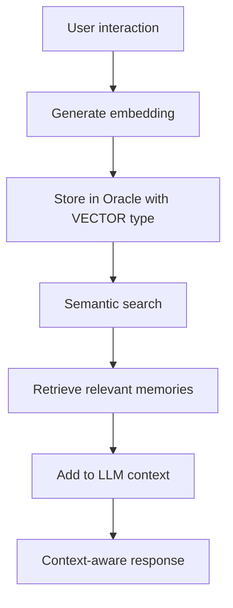

# Beyond Chat History: Building Persistent, Semantic Memory for AI Agents
## Building Agentic Memory with Oracle AI Vector Search

*A practical guide to moving beyond simple chat history, using Oracle Database's vector search to give your AI agents a semantic memory that works across conversations.*

## What Is Agentic Memory?

When you chat with an AI assistant, you expect it to remember what you said earlier in the conversation. You don't want to repeat yourself. You want the agent to understand context from previous messages.

That's basic conversation history. But what about remembering things across sessions? Or finding relevant information from weeks ago when it matters?

**Agentic memory** is when an AI agent can:
- Store information from conversations.
- Retrieve relevant information based on meaning (not just keywords).
- Use that context in future interactions.

Think about how humans remember conversations. You don't remember exact words, but you remember the meaning. If someone mentions they "prefer email" in one conversation, you remember that preference when deciding how to contact them later, even if you search your memory for "how to reach this person."

That's semantic memory. And that's what we're building here.


## The Technical Challenge

The problem is that traditional databases and keyword search don't work well for this:

**Keyword search fails:**
```
Stored: "User prefers email notifications"
Search: "communication preference"
Result: No match (different words)
```

**Semantic search works:**
```
Stored: "User prefers email notifications"  
Search: "communication preference"
Result: Found. (same meaning)
```

To do this, you need:
1. **Vector embeddings**: Convert text to numbers that capture meaning.
2. **Vector database**: Store and search these embeddings efficiently.
3. **Similarity search**: Find semantically similar content.

This is the foundation of RAG (Retrieval-Augmented Generation), giving LLMs relevant context to generate better responses.

## Why This Matters for AI Agents

Any AI system that interacts with users over time needs memory:

- **Customer support bots**: Remember user preferences and past issues.
- **Personal assistants**: Recall user schedules, habits, preferences.
- **Conversation agents**: Maintain context across multiple interactions.
- **Knowledge systems**: Find relevant information from large datasets.

Without memory, every interaction starts from scratch. With memory, agents become genuinely useful.


## My Specific Problem

Last year, I worked on a conversation agent for a loan optimization system (can't share specifics due to data protection). The agent would call borrowers, have conversations in multiple languages (English, Hindi, Marathi, Kannada), and record summaries.

The challenge: finding relevant information from past conversations. We stored transcripts, but keyword search was painful:

- Someone says "I'll pay next week" in one call.
- Later asks "when did I say I'd pay?"
- We'd manually search through transcripts.

Or worse:
- Agent calls borrower for follow-up.
- Has no context from previous conversation.
- Borrower has to repeat everything.

Frustrating for everyone.

**What we needed:** Search by meaning, "What did this borrower say about payment?". Should find "I'll pay next week" even though the words don't match.

That's when I started exploring semantic memory with vector search. This project is that exploration, using Oracle Autonomous Database.


## Why Oracle for This?

I'll be honest about the technical reasons I chose Oracle for this exploration.

### Oracle Database 

While solutions like pgvector, PostgreSQL or dedicated vector DBs (Weaviate, Qdrant) are great choices, Oracle 26ai was the right fit for this specific scenario because:

**1. Native VECTOR data type**

Most databases need extensions (like pgvector for PostgreSQL). Oracle built vector support directly into the database:

```sql
CREATE TABLE memories (
    embedding VECTOR(384, FLOAT32)  -- Native type, no plugins
);
```

This means:
- Better performance (optimized by the database engine).
- No extension management.
- Integrated with SQL query optimizer.

**2. Hybrid SQL + vector queries**

This was crucial. In the loan system, we'd need queries like:

```sql
-- Find similar conversations from specific region
WHERE geography = 'Maharashtra'
AND risk_score > 0.7
AND VECTOR_DISTANCE(embedding, query_vector, COSINE) < 0.3
```

You can't do this cleanly with separate vector and SQL databases. You'd have to:
1. Query vector DB for similar items.
2. Filter results in application code.
3. Query SQL DB for metadata.
4. Merge results.

With Oracle, it's one query.

**3. Data protection**

For the loan system, data couldn't leave our infrastructure (financial regulations, data protection).

Using Oracle with local embeddings (sentence-transformers):
- All data stays on our servers.
- No external API calls.
- Full control over data flow.

With services like Pinecone or API-based embeddings (OpenAI), you're sending potentially sensitive data externally.

**4. Production reliability**

For financial systems, you need:
- ACID transactions (data integrity).
- 99.95% SLA.
- Enterprise support.
- Audit trails.

Oracle provides this. It's not the most exciting reason, but it matters for production deployments.


## The Architecture

Here's the complete system:




The heart of this architecture is a simple table. Here's the schema we'll use:
Simple. One database, clean queries, local embeddings.

## The Database Schema

Starting with the simplest schema that works:

```sql
CREATE TABLE memories (
    id NUMBER GENERATED ALWAYS AS IDENTITY PRIMARY KEY,
    text CLOB NOT NULL,
    embedding VECTOR(384, FLOAT32),
    memory_type VARCHAR2(50),
    created_at TIMESTAMP DEFAULT CURRENT_TIMESTAMP
);
```

**Field explanations:**

- `text` (CLOB): The actual memory content. CLOB handles both short ("User prefers email") and long text (conversation summaries).

- `embedding` (VECTOR): 384-dimensional semantic representation. This is the key- Oracle's native vector type.

- `memory_type`: Category: `preference`, `issue`, `inquiry`, `resolution`, `context`, etc. Helpful for filtering.

- `created_at`: Timestamp for temporal queries (find recent memories).

**Why 384 dimensions?**

That's what the `all-MiniLM-L6-v2` model outputs. It's a good balance:
- Small enough to be fast.
- Large enough to capture semantic meaning.
- Well-tested in production systems.

Could use bigger models (768, 1536 dimensions) for more nuance, but 384 works well and is faster.


## Generating Embeddings

Using `sentence-transformers` because:
- **Free**: No API costs.
- **Local**: Data doesn't leave server (important for data protection).
- **Fast**: ~50ms per text on standard hardware.
- **Good enough**: Solid semantic understanding.

```python
from sentence_transformers import SentenceTransformer

model = SentenceTransformer('all-MiniLM-L6-v2')

def get_embedding(text):
    return model.encode(text).tolist()
```

That's it. 384 numbers representing semantic meaning.

**Performance:** On my laptop, this takes about 50ms per text. For batch processing, 100 texts in ~2 seconds. Fast enough for real-time chat.


## Storing Memories

Here's how you store a memory with its embedding:

```python
def store_memory(text, memory_type):
    # Generate embedding locally
    embedding = get_embedding(text)
    embedding_str = str(embedding)
    
    # Store in Oracle
    cursor.execute("""
        INSERT INTO memories (text, embedding, memory_type)
        VALUES (:1, TO_VECTOR(:2), :3)
    """, [text, embedding_str, memory_type])
```

**Developer Note: Handling Embeddings in python-oracledb**: When using the Thick mode of the Oracle client, you need to pass the embedding as a string and use the `TO_VECTOR()` SQL function. This is a common stumbling block.


## Semantic Search

This is where it gets useful:

```python
def search_memories(query, top_k=5):
    # Generate query embedding
    query_embedding = get_embedding(query)
    query_str = str(query_embedding)
    
    # Search using vector similarity
    cursor.execute("""
        SELECT 
            text,
            (1 - VECTOR_DISTANCE(embedding, TO_VECTOR(:1), COSINE)) as similarity
        FROM memories
        ORDER BY similarity DESC
        FETCH FIRST :2 ROWS ONLY
    """, [query_str, top_k])
    
    return cursor.fetchall()
```

**How it works:**

- `VECTOR_DISTANCE` calculates cosine distance between vectors.
- Lower distance = more similar
- We do `1 - distance` to get similarity score (0-1, higher = better).

**Real example from testing:**

```
Stored: "User prefers email notifications over SMS"
Query: "What's the user's communication preference?"
Similarity: 0.847

Stored: "User reported slow upload speeds"
Query: "Are there any technical problems?"
Similarity: 0.782
```

It finds relevant information even when words don't match exactly.


## The RAG Pattern

This is how you use agentic memory with LLMs.

**Without memory:**
```
User: "What's my notification preference?"
LLM: "I don't have information about your preferences."
```

**With memory (RAG):**

```python
# 1. Search for relevant memories
memories = search_memories("notification preference", top_k=3)

# 2. Build context from memories
context = "\n".join([m[0] for m in memories])

# 3. Create prompt with context
prompt = f"""Based on these facts about the user:
{context}

User question: {query}

Provide a helpful response."""

# 4. Call LLM
response = llm.generate(prompt)
```

Now the LLM has context and gives informed answers.

**Example from the loan system:**

Agent about to call borrower:
```python
# Search previous conversations
context = search_memories(f"borrower {id} payment discussions")

# Gets:
# - "Promised payment by 15th March"
# - "Mentioned medical emergency"
# - "Tone was cooperative"

# Agent starts call with context
"Hi, I'm following up on your payment. I see you mentioned medical expenses last time. How are things now?"
```

Better experience for everyone. The borrower doesn't repeat themselves, the agent has context.


## What I Learned Building This

**1. Oracle's vector search is solid**

Consistently sub-30ms search times with thousands of vectors. The in-memory indexes work well. At scale (with proper indexing), Oracle documentation shows it handling millions of vectors.

**2. Hybrid queries are genuinely powerful**

Being able to combine semantic search with business logic in one query is useful:

```sql
-- Find similar cases from high-risk borrowers in specific region
WHERE risk_score > 0.7
AND geography = 'Maharashtra'
AND created_at > CURRENT_TIMESTAMP - INTERVAL '30' DAY
AND VECTOR_DISTANCE(embedding, query_vector, COSINE) < 0.3
```

Can't do this cleanly with separate systems.

**3. Local embeddings matter for data protection**

Using sentence-transformers means conversation data never leaves your infrastructure. For financial/healthcare systems, this is important.

**4. Memory types improve accuracy**

Initially I stored everything as generic text. Adding categories (`preference`, `issue`, `resolution`) made searches more accurate.

**5. 384 dimensions is enough**

I was tempted to use bigger models (768-dimensional embeddings), but 384 worked fine and is faster. Bigger isn't always better.

**6. The notebook is crucial for debugging**
Seeing the actual embeddings and similarity scores in the notebook helped debug why some searches didn't work as expected. Visualizing the vector space would be my next step.


## Benchmarks

Testing on Oracle's free tier (Always Free):

**Storage:**
- Insert with embedding: ~50-100ms
- Batch inserts (10 at once): ~500ms

**Search:**
- 1,000 memories: ~15ms
- 5,000 memories: ~25ms
- 10,000 memories: ~40ms

Fast enough for production. With proper indexing, Oracle scales to millions of vectors.


## Production Considerations

For a production system, you'd add:

### 1. User/Borrower Isolation
```sql
ALTER TABLE memories ADD user_id VARCHAR2(100);
CREATE INDEX idx_user_id ON memories(user_id);

-- Search only this user's memories
WHERE user_id = :id
AND VECTOR_DISTANCE(embedding, query_vector, COSINE) < 0.3
```

### 2. Vector Indexes for Scale
```sql
CREATE VECTOR INDEX memory_idx ON memories(embedding)
ORGANIZATION INMEMORY NEIGHBOR GRAPH
WITH TARGET ACCURACY 95;
```

### 3. Hybrid Queries
```sql
-- Combine semantic search with business rules
WHERE memory_type = 'issue'
AND created_at > CURRENT_TIMESTAMP - INTERVAL '7' DAY
AND VECTOR_DISTANCE(embedding, query_vector, COSINE) < 0.3
```

### 4. Memory Management
- Consolidate similar memories periodically.
- Clean old memories.
- Implement importance scoring.

### 5. Multi-language Support
```python
# Use multilingual models for systems handling multiple languages
model = SentenceTransformer('paraphrase-multilingual-MiniLM-L12-v2')

```

### 6. Tokenization Limits
Remember: `all-MiniLM-L6-v2` has a 256-word token limit. For longer conversations, you'll need to chunk text or use a model with longer context.


## Where This Could Go

Extensions for different use cases:

**Customer support:**
```python
memory.store("User reported login issue", "issue")
memory.store("Fixed by resetting password", "resolution")
# Later: search("user problems"), finds both
```

**Personal assistant:**
```python
memory.store("User has team meeting every Monday 10am", "schedule")
# Later: search("recurring meetings"), finds it
```

**Knowledge management:**
```python
memory.store("Project Alpha budget approved Q2", "decision")
# Later: search("budget approvals"), finds relevant decisions
```


## The Code

Complete working implementation is in the Jupyter notebook:
1. Database setup with VECTOR type
2. Embedding generation
3. Memory storage
4. Semantic search
5. RAG pattern demonstration

Everything you need to add semantic memory to an AI agent.


## Why This Approach Works

After building this:

- **Simplicity:** One database, two operations (store, search). Maintainable.

- **Oracle handles complexity:** Vector indexing, similarity search, query optimization- Oracle does this well.

- **Data stays internal:** Local embeddings mean sensitive data never leaves your server.

- **Hybrid queries:** Semantic search + business logic in one query.

- **Production-ready:** ACID transactions, 99.95% SLA, enterprise support.

- **Scales:** From prototype to millions of vectors.


## Wrapping Up

The conversation agent I worked on would have benefited from this. Instead of manually searching transcripts, we could have asked "What did this borrower say about their situation?" and found relevant context immediately.

With Oracle's vector support, implementing semantic memory is straightforward:
- One table with VECTOR column.
- One embedding model.
- Two SQL operations (insert, search).
- About a week to explore and build.

If you're building conversation agents, chatbots, or any system needing semantic memory, this pattern is worth implementing.

Ready to build? Clone the repository and open the `agent_memory.ipynb` notebook to run the complete example step-by-step.


## Resources

- [Jupter Notebook Link](https://github.com/srinidhi-sat/agent-memory/agent_memory.ipynb)
- [Oracle 26ai Vector Search Documentation](https://docs.oracle.com/en/database/oracle/oracle-database/26/vecse/)
- [Sentence Transformers](https://www.sbert.net/)
- [python-oracledb](https://python-oracledb.readthedocs.io/)
- [Python 3.9+](https://www.python.org/downloads/)
- [Oracle Always Free Tier](https://www.oracle.com/cloud/free/)


*This project was built to explore semantic memory for AI agents, based on challenges encountered in a loan conversation system. The implementation demonstrates Oracle 26ai's vector capabilities with a practical, production-ready approach.*
